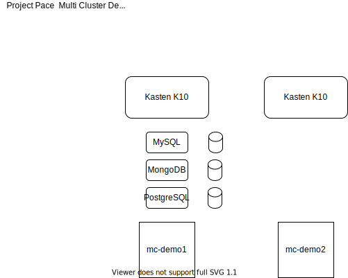

## Project Pace - Multi Cluster Deployment (WORK IN PROGRESS)

As you can tell by the title this folder consists of getting multiple Kubernetes clusters up and running locally on your system using the multicluster_demo.sh this will deploy 2 clusters locally named mc-demo1 and mc-demo2 with data services also being deployed on mc-demo1. 

Kasten K10 will be deployed on both clusters. 

My next steps here are to include metallb to introduce ingress to the clusters so that we can also demonstrate K10 MultiCluster. I am not sure how this will work across OS platforms especially when trying to use docker as I think this would not work with MacOS and Windows but would work for Linux. 

