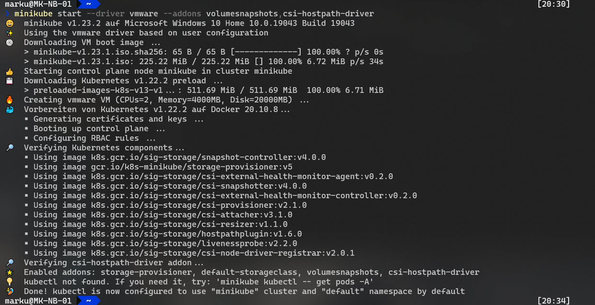

# Project Pace
- [Project Pace](#project-pace)
- [Deploying a Kubernetes cluster on your local machine](#deploying-a-kubernetes-cluster-on-your-local-machine)
  - [Pre-reqs](#pre-reqs)
    - [Pre-reqs on Windows](#pre-reqs-on-windows)
  - [Other Pre-reqs & notes](#other-pre-reqs--notes)
  - [Minikube](#minikube)
    - [Minicube on Windows with VMware Workstation](#minicube-on-windows-with-vmware-workstation)
  - [Kasten K10](#kasten-k10)
  - [MySQL](#mysql)
    - [Step 1 - Deploy your mysql app for the first time](#step-1---deploy-your-mysql-app-for-the-first-time)
    - [Step 2 - Add Data Source](#step-2---add-data-source)
        - [Step 2a - Create a MySQL CLIENT](#step-2a---create-a-mysql-client)
        - [Step 2b - Add Data to MySQL](#step-2b---add-data-to-mysql)
  - [Create and Perform a backup of your data service](#create-and-perform-a-backup-of-your-data-service)
  - [Application Restore with Transformation](#application-restore-with-transformation)
  - [Delete cluster](#delete-cluster)
- [Exporting data using Minio S3 Storage](#exporting-data-using-minio-s3-storage)
  - [Install Minio](#install-minio)
  - [Accessing Minio](#accessing-minio)
  - [Configuring Minio](#configuring-minio)
  - [Configure S3 storage in Kasten](#configure-s3-storage-in-kasten)
  - [Configure the Kasten Policy to export data to the S3 Storage](#configure-the-kasten-policy-to-export-data-to-the-s3-storage)

Additional Resources - [vZilla blog](https://vzilla.co.uk/vzilla-blog/project_pace-kasten-k10-demo-environment-for-everyone)

# Deploying a Kubernetes cluster on your local machine 

This walkthrough enables you to deploy a Kubernetes cluster on your local workstation along with a Data Service (MySQL) and Kasten K10 to focus on Data Management of your Data Services. 

We will also optionally deploy a minio cluster which can act as an export repository for your backups, this is not seen as best practice in anyway but this walkthrough is good for hands on experience and learning. 

## Pre-reqs

- minikube - https://minikube.sigs.k8s.io/docs/start/ 
- helm - https://helm.sh/docs/intro/install/
- kubectl - https://kubernetes.io/docs/tasks/tools/ 

Container or virtual machine manager, such as: Docker, Hyperkit, Hyper-V, KVM, Parallels, Podman, VirtualBox, or VMware

I would also suggest that we need bash which means the advice for Windows users is install Git bash but for best experience use WSL 

For the above pre-reqs I use Arkade (https://github.com/alexellis/arkade) 

```
arkade get minikube helm kubectl
```

### Pre-reqs on Windows

All Pre-reqs on Windows are available as a [Chocolatey](https://chocolatey.org/) package.

```
choco install minikube
```

```
choco install kubernetes-helm
```

```
choco install kubernetes-cli
```

## Other Pre-reqs & notes

Whilst testing with Mac OS X and Docker, we noticed performance issues, when Kubernetes was enabled within Docker, and the new experimental feature also enabled "Use the new Virtualization framework". Disabling this experimental feature and kubernetes and restarting docker and minikube resulted in a more performant lab environment. 


## Minikube 
The first time you run the command below you will have to wait for the images to be downloaded locally to your machine, if you remove the container-runtime then the default will use docker. You can also add --driver=virtualbox if you want to use local virtualisation on your system. 

for reference on my ubuntu laptop this process took 6m 52s to deploy the minikube cluster

```
minikube start --addons volumesnapshots,csi-hostpath-driver --apiserver-port=6443 --container-runtime=containerd -p mc-demo --kubernetes-version=1.21.2 
```

I am also adding this as an option if you are using virtualbox this will command will create in virtualbox 

```
 minikube start --driver=virtualbox --addons volumesnapshots,csi-hostpath-driver,metallb --nodes 2 -p cade-demo container-runtime=containerd --kubernetes-version=1.21.2 --apiserver-port=6443
```

You can also set resource controls by using the following arguments with the above ```minikube start``` commands.

```
-cpus='2': Number of CPUs allocated to Kubernetes. Use "max" to use the
maximum number of CPUs.

--memory='': Amount of RAM to allocate to Kubernetes (format:
<number>[<unit>], where unit = b, k, m or g). Use "max" to use the maximum
amount of memory.
```

### MiniKube on Windows with VMware Workstation 

```
$Env:Path += ";C:\Program Files (x86)\VMware\VMware Workstation"
minikube start --driver vmware --addons volumesnapshots,csi-hostpath-driver
```




## Kasten K10 

Add the Kasten Helm repository

``` 
helm repo add kasten https://charts.kasten.io/
```
Create the namespace and deploy K10, note that this will take around 5 mins 

```
kubectl create namespace kasten-io
helm install k10 kasten/k10 --namespace=kasten-io --set auth.tokenAuth.enabled=true --set injectKanisterSidecar.enabled=true --set-string injectKanisterSidecar.namespaceSelector.matchLabels.k10/injectKanisterSidecar=true
```
You can watch the pods come up by running the following command.
```
kubectl get pods -n kasten-io -w
```
port forward to access the K10 dashboard, open a new terminal to run the below command

```
kubectl --namespace kasten-io port-forward service/gateway 8080:8000
```

The Kasten dashboard will be available at: `http://127.0.0.1:8080/k10/#/`

To authenticate with the dashboard we now need the token which we can get with the following commands. 

```
TOKEN_NAME=$(kubectl get secret --namespace kasten-io|grep k10-k10-token | cut -d " " -f 1)
TOKEN=$(kubectl get secret --namespace kasten-io $TOKEN_NAME -o jsonpath="{.data.token}" | base64 --decode)

echo "Token value: "
echo $TOKEN
```


Annotate the CSI Hostpath VolumeSnapshotClass for use with K10

```
kubectl annotate volumesnapshotclass csi-hostpath-snapclass \
    k10.kasten.io/is-snapshot-class=true
```
we also need to change our default storageclass with the following 

```
kubectl patch storageclass csi-hostpath-sc -p '{"metadata": {"annotations":{"storageclass.kubernetes.io/is-default-class":"true"}}}'

kubectl patch storageclass standard -p '{"metadata": {"annotations":{"storageclass.kubernetes.io/is-default-class":"false"}}}'
```

## MySQL
### Step 1 - Deploy your mysql app for the first time 

Deploying mysql via helm:

```
APP_NAME=my-production-app
kubectl create ns ${APP_NAME}
helm repo add bitnami https://charts.bitnami.com/bitnami
helm install mysql-store bitnami/mysql --set primary.persistence.size=1Gi,volumePermissions.enabled=true --namespace=${APP_NAME}
kubectl get pods -n ${APP_NAME} -w
```

### Step 2 - Add Data Source
Populate the mysql database with initial data, run the following:

```
MYSQL_ROOT_PASSWORD=$(kubectl get secret --namespace ${APP_NAME} mysql-store -o jsonpath="{.data.mysql-root-password}" | base64 --decode)
MYSQL_HOST=mysql-store.${APP_NAME}.svc.cluster.local
MYSQL_EXEC="mysql -h ${MYSQL_HOST} -u root --password=${MYSQL_ROOT_PASSWORD} -DmyImportantData -t"
echo MYSQL_ROOT_PASSWORD=${MYSQL_ROOT_PASSWORD}
```

##### Step 2a - Create a MySQL CLIENT 
We will run another container image to act as our client

```
APP_NAME=my-production-app
kubectl run mysql-client --rm --env APP_NS=${APP_NAME} --env MYSQL_EXEC="${MYSQL_EXEC}" --env MYSQL_ROOT_PASSWORD=${MYSQL_ROOT_PASSWORD} --env MYSQL_HOST=${MYSQL_HOST} --namespace ${APP_NAME} --tty -i --restart='Never' --image  docker.io/bitnami/mysql:latest --command -- bash
```
```
Note: if you already have an existing mysql client pod running, delete with the command

kubectl delete pod -n ${APP_NAME} mysql-client
```

##### Step 2b - Add Data to MySQL

```
echo "create database myImportantData;" | mysql -h ${MYSQL_HOST} -u root --password=${MYSQL_ROOT_PASSWORD}
MYSQL_EXEC="mysql -h ${MYSQL_HOST} -u root --password=${MYSQL_ROOT_PASSWORD} -DmyImportantData -t"
echo "drop table Accounts" | ${MYSQL_EXEC}
echo "create table if not exists Accounts(name text, balance integer); insert into Accounts values('nick', 0);" |  ${MYSQL_EXEC}
echo "insert into Accounts values('albert', 112);" | ${MYSQL_EXEC}
echo "insert into Accounts values('alfred', 358);" | ${MYSQL_EXEC}
echo "insert into Accounts values('beatrice', 1321);" | ${MYSQL_EXEC}
echo "insert into Accounts values('bartholomew', 34);" | ${MYSQL_EXEC}
echo "insert into Accounts values('edward', 5589);" | ${MYSQL_EXEC}
echo "insert into Accounts values('edwin', 144);" | ${MYSQL_EXEC}
echo "insert into Accounts values('edwina', 233);" | ${MYSQL_EXEC}
echo "insert into Accounts values('rastapopoulos', 377);" | ${MYSQL_EXEC}
echo "select * from Accounts;" |  ${MYSQL_EXEC}
exit
```

## Create and Perform a backup of your data service 
In the K10 dashboard walkthrough and create yourself a policy to protect your mySQL data.
1. On the homescreen, click the Applications Tile
2. On the "my-production-app" tile, click "Create a Policy", change any of the settings as needed.
3. When the policy is created, click "Run Now" on the tile.

## Application Restore with Transformation 
First lets check our storageclass options within our cluster with the following command, you will see that we have two we have a CSI and standard. 

```
kubectl get storageclass
``` 

Lets restore a clone of our data into a new namespace on a different storageclass by using transformations. 
In the K10 dashboard walkthrough and restore the application.
1. On the homescreen, click Green "Compliant" button on the Application tile. 
2. On the "my-production-app" tile, click the restore button, select the a restore point. 
3. Under the heading "Application Name" select "Create a new namespace", provide a name and save (we used clone for the below example). 
4. Under the heading "Optional Restore Settings" select "Apply transforms to restored resources".
5. Click "Add New Transform", on the transform screen, select in the top right, "Use an example" and "change storageClass".
6. Under operations change the value to "standard" and click the "Edit Transform" button and then "Create Transform" button.
7. Click "Restore" button and confirm the restore.
8. You can monitor the progress on the homepage.

Once the restore is completed, we connect to the DB to confirm the values in the table are present.

```
APP_NAME=clone
kubectl run mysql-client --rm --env APP_NS=${APP_NAME} --env MYSQL_EXEC="${MYSQL_EXEC}" --env MYSQL_ROOT_PASSWORD=${MYSQL_ROOT_PASSWORD} --env MYSQL_HOST=${MYSQL_HOST} --namespace ${APP_NAME} --tty -i --restart='Never' --image  docker.io/bitnami/mysql:latest --command -- bash

# within the container run
echo "select * from Accounts;" |  ${MYSQL_EXEC}
exit 
```

## Delete cluster 
When you are finished with the demo you can simply delete the cluster using the following command note if you have changed the name in the above steps then you will need to also update things here. 

```
minikube delete -p mc-demo
```

# Exporting data using Minio S3 Storage  
In this optional section we will go against best practices and deploy our object storage export location for our K10 backups 

## Install Minio
```
helm repo add minio https://helm.min.io/
helm install --namespace minio-operator --create-namespace --generate-name minio/minio-operator
```
## Accessing Minio

Get the JWT for logging in to the console
````
kubectl get secret $(kubectl get serviceaccount console-sa --namespace minio-operator -o jsonpath="{.secrets[0].name}") --namespace minio-operator -o jsonpath="{.data.token}" | base64 --decode
````
Open a new terminal window to setup port forward to access the Minio Management page in your browser
````
kubectl --namespace minio-operator port-forward svc/console 9090:9090
````
Open your browser to http://127.0.0.1:9090 and login with the token from the above step.

## Configuring Minio

On the Tenants tab, select the default tenant (should be named "minio1", then select the "Manage Tenant" button.

1. Within the tenant, click "Service Accounts" and create a service account with the default settings. Copy the Access Key and Secret Key or download the file. 
2. Click Buckets, and create a bucket with the default settings.

## Configure S3 storage in Kasten
1. Click settings in the top right hand corner. Select locations and Create new location.
2. Provide a name, select "S3 Compatible", enter your Access Key and Secret Key you saved earlier.
3. Set the endpoint as "minio.default.svc.cluster.local" (this is the internal k8s dns name) and select to skip SSL verification.  
4. Provide the bucket name you configured and click "Save Profile".

## Configure the Kasten Policy to export data to the S3 Storage
1. Edit your existing policy.
2. Enable the setting "Enable Backups via Snapshot Exports"
3. Select the S3 location profile you have just created, and set the schedule as necessary. Click the "Edit Policy" button. 
4. Manually run the policy and observe the run on the homescreen. After the backup run, you will see a new task called "Export".

Manually browse the Bucket from the Minio browser console, you will see your bucket contains a folder called "k10" and within that the protection data. 


